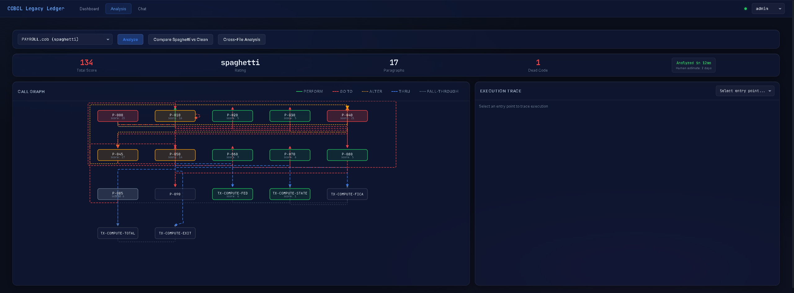

# COBOL Legacy Ledger

[](https://cobol-legacy-ledger-production.up.railway.app/console/)

[](https://github.com/albertdobmeyer/cobol-legacy-ledger/actions/workflows/ci.yml)


**Learn COBOL through a live banking system** — run simulations, corrupt ledgers, catch fraud with SHA-256 hash chains, and explore spaghetti code with AI-powered static analysis.

> "COBOL isn't the problem. Lack of observability is."

This is a fully functional **6-node inter-bank settlement system** in COBOL, wrapped with a Python read/write bridge that adds cryptographic integrity without modifying a single line of legacy code. An AI tutor (Ollama local or Claude cloud) can explain any paragraph, trace execution paths, and compare spaghetti vs clean code side by side. Every source file teaches COBOL syntax, banking concepts, and integration patterns inline.

## At a Glance

**Stack**: COBOL (GnuCOBOL) · Python 3.9+ · FastAPI · SQLite · Vanilla JS · Docker

- **18 COBOL programs** (10 clean + 8 intentional spaghetti) with a Python observation layer — no legacy code modified
- **SHA-256 hash chain** integrity across 6 independent banking nodes, with live tamper detection in <100ms
- **807 automated tests** (unit, integration, E2E browser), CI with linting, multi-version Python matrix
- **AI-powered static analysis** — call graphs, dead code detection, complexity scoring, cross-file dependency mapping

**See it in action**: Run `./scripts/prove.sh` to compile, seed, settle, verify, tamper, and detect — or try the [live demo](https://cobol-legacy-ledger-production.up.railway.app/console/).

## How to Use This Repository

### For Students (Self-Study)

Start with the **[Learning Path](docs/LEARNING_PATH.md)** — a guided reading order from beginner to advanced, with exercises at each stage.

### For Instructors

See the **[Teaching Guide](docs/TEACHING_GUIDE.md)** — 10 structured lessons covering COBOL fundamentals through modern integration, with objectives and exercises for each lesson. Three graded lab assignments with rubrics are in **[Assessments](docs/ASSESSMENTS.md)**.

### For Reference

The **[Glossary](docs/GLOSSARY.md)** defines every COBOL keyword, banking term, and project-specific concept used in the codebase.

## Quick Start

### 1. Clone and install

```bash
git clone https://github.com/albertdobmeyer/cobol-legacy-ledger.git
cd cobol-legacy-ledger
pip install -e ".[dev]"
```

### 2. Seed the banking network

```bash
python -m python.cli seed-all      # creates 42 accounts across 6 nodes
```

### 3. Start the server

```bash
python -m uvicorn python.api.app:create_app --factory --host 127.0.0.1 --port 8000
```

Open **http://localhost:8000/console/** — hit **Start** to run a simulation, or try **Corrupt Ledger** then **Integrity Check** to see SHA-256 tamper detection.

### Alternative: Docker (zero dependencies)

```bash
docker compose up
```

### Alternative: Makefile (Linux/macOS with `make`)

```bash
make lab-setup   # venv + deps + seed + smoke test
make run         # start server
make prove       # full end-to-end proof: compile → seed → settle → verify → tamper → detect
```

> **Note**: `make` is not available by default on Windows. Use the Python commands above, or install `make` via [Chocolatey](https://chocolatey.org/) (`choco install make`) or use Git Bash/WSL.

### What `prove.sh` demonstrates

The proof script runs the full system lifecycle:

1. **Compiles** 18 COBOL programs (10 banking + 8 payment processor sidecar)
2. **Seeds** 6 independent banking nodes (42 accounts, $100M+ in balances)
3. **Settles** an inter-bank transfer: Alice@BANK_A pays Bob@BANK_B $2,500 through the clearing house
4. **Verifies** all SHA-256 hash chains intact across the network
5. **Tampers** one bank's ledger directly (bypassing COBOL and the integrity chain)
6. **Detects** the tamper in <100ms via balance reconciliation

GnuCOBOL is optional — the system falls back to Python-only mode if `cobc` isn't installed.

The **web console** at `http://localhost:8000/console/` provides:
- **Dashboard** — Hub-and-spoke network with health rings, split transaction log (outgoing/incoming), live COBOL ticker viewport with syntax highlighting, simulation controls
- **Analysis** — Orthogonal call graph with toggleable edge types, execution trace, dead code detection, complexity scoring, cross-file dependency analysis, spaghetti-vs-clean comparison
- **Chat** — LLM chatbot with tool-use cards, tutor mode, prompt chips, provider switching (Ollama/Anthropic), session management

<p align="center">
  
</p>
<p align="center">
  
</p>
<p align="center">
  
</p>

## Features at a Glance

- **18 production COBOL programs** — 10 clean banking + 8 intentional spaghetti spanning 1974-2012
- **800 automated tests** — unit, integration, E2E browser (Playwright)
- **Real-time 6-node banking simulation** via Server-Sent Events
- **SHA-256 tamper detection** in <100ms across all nodes
- **AI-powered COBOL tutor** (Ollama local / Claude cloud) with 19 RBAC-gated analysis tools
- **Spaghetti archaeology** — GO TO networks, ALTER state machines, 6-level nested IF, Y2K dead code
- **Cross-file dependency analysis** with shared copybook detection
- **"Analyzed in 47ms. Human estimate: 3-5 days."** — human vs AI comparison timer
- **10 lessons, 3 graded labs**, classroom checkpoint save/restore
- **One-click setup**: `docker compose up` / `make lab-setup` / GitHub Codespaces

## What You'll Learn

### COBOL Fundamentals (Lessons 1-4)

| Concept | Where to Find It | File |
|---------|-------------------|------|
| Four divisions (IDENTIFICATION, ENVIRONMENT, DATA, PROCEDURE) | Every `.cob` file | Start with `SMOKETEST.cob` |
| PIC clauses (`X`, `9`, `S9`, `V99`) | Copybook annotations | `ACCTREC.cpy`, `TRANSREC.cpy` |
| 88-level condition names | Account status flags | `ACCTREC.cpy`, `COMCODE.cpy` |
| FILE-CONTROL / SELECT ASSIGN | File-to-program binding | `ACCOUNTS.cob` |
| COPY statement (copybooks) | Shared record definitions | Every `.cob` file |
| PERFORM / PERFORM VARYING | Loops and subroutines | `ACCOUNTS.cob`, `TRANSACT.cob` |
| EVALUATE TRUE | Switch/case equivalent | `TRANSACT.cob`, `REPORTS.cob` |
| STRING / UNSTRING | String manipulation | `ACCOUNTS.cob`, `TRANSACT.cob` |

### Banking Operations (Lessons 5-7)

| Concept | Where to Find It | File |
|---------|-------------------|------|
| Account lifecycle (CRUD) | Account master file operations | `ACCOUNTS.cob` |
| Transaction processing | Deposits, withdrawals, transfers | `TRANSACT.cob` |
| Batch processing | Pipe-delimited input files | `TRANSACT.cob` (BATCH mode) |
| Interest accrual | COMPUTE with ROUNDED | `INTEREST.cob` |
| Fee processing | Balance floor protection | `FEES.cob` |
| Reconciliation | Cross-file balance verification | `RECONCILE.cob` |
| Inter-bank settlement | 3-leg clearing house settlement | `SETTLE.cob` |

### Modern Integration (Lesson 8)

| Concept | Where to Find It | File |
|---------|-------------------|------|
| COBOL subprocess wrapping | Mode A: calling COBOL from Python | `python/bridge.py` |
| Fixed-width file I/O | Mode B: Python reads/writes DAT files | `python/bridge.py` |
| SHA-256 hash chains | Cryptographic tamper detection | `python/integrity.py` |
| Cross-node verification | Multi-node settlement matching | `python/cross_verify.py` |
| REST API (FastAPI) | HTTP endpoints wrapping all operations | `python/api/` |
| LLM tool-use | AI chatbot with RBAC-gated banking tools | `python/llm/` |

### Legacy Code Archaeology (Lesson 9)

| Concept | Where to Find It | File |
|---------|-------------------|------|
| GO TO networks | Paragraph spaghetti, non-sequential flow | `PAYROLL.cob`, `MERCHANT.cob` |
| ALTER statement | Runtime GO TO modification, state machines | `PAYROLL.cob`, `DISPUTE.cob` |
| PERFORM THRU | Paragraph range execution | `TAXCALC.cob` |
| Nested IF (no END-IF) | Period-terminated 6-level nesting | `TAXCALC.cob` |
| GO TO DEPENDING ON | Computed branching | `MERCHANT.cob` |
| SORT INPUT/OUTPUT PROCEDURE | Callback-style file processing | `FEEENGN.cob` |
| INSPECT TALLYING | String scanning for risk scoring | `RISKCHK.cob` |
| Dead code | Unreachable paragraphs left for decades | All payroll/payment programs |
| Misleading comments | Code/comment divergence over time | `TAXCALC.cob`, `DEDUCTN.cob` |

### Static Analysis Tools (Lesson 10)

| Concept | Where to Find It | File |
|---------|-------------------|------|
| Call graph analysis | Paragraph dependency mapping | `python/cobol_analyzer/call_graph.py` |
| Execution tracing | GO TO/ALTER chain resolution | `python/cobol_analyzer/call_graph.py` |
| Dead code detection | Reachability analysis | `python/cobol_analyzer/dead_code.py` |
| Complexity scoring | Per-paragraph anti-pattern weighting | `python/cobol_analyzer/complexity.py` |
| Pattern knowledge base | COBOL idiom encyclopedia | `python/cobol_analyzer/knowledge_base.py` |
| Cross-file analysis | Multi-program CALL/COPY dependency graphs | `python/cobol_analyzer/cross_file.py` |

## Architecture

```
                    ┌─────────────────────┐
                    │  Layer 4: Console   │
                    │  Glass Morphism UI  │
                    │  Dashboard + Chat   │
                    └─────────┬───────────┘
                              │
                    ┌─────────┴───────────┐
                    │   Layer 3: LLM/API  │
                    │  FastAPI + Tool-Use │
                    │  Ollama / Anthropic  │
                    └─────────┬───────────┘
                              │
                    ┌─────────┴───────────┐
                    │  Layer 2: Python     │
                    │  Bridge + Integrity  │
                    │  Settlement + RBAC   │
                    └─────────┬───────────┘
                              │
                    ┌─────────┴───────────┐
                    │  Layer 5: Analysis  │
                    │  Call Graph + Trace │
                    │  Dead Code + Score  │
                    │  Cross-File Deps    │
                    └─────────┬───────────┘
                              │
BANK_A ─────┐                 │                ┌───── BANK_D
BANK_B ─────┤◄── Settlement ──┤──────────────►├───── BANK_E
BANK_C ─────┘    Coordinator  │                └───── CLEARING
                              │
                    ┌─────────┴───────────┐
                    │  Layer 1: COBOL     │
                    │  18 programs, DAT   │
                    │  SHA-256 chain/node  │
                    └─────────────────────┘
```

**6 nodes** (5 banks + 1 clearing house), each with:
- `ACCOUNTS.DAT` — COBOL fixed-width account records (70 bytes each)
- `TRANSACT.DAT` — COBOL transaction log (103 bytes each)
- `{node}.db` — SQLite with integrity chain, transaction history, account snapshots

**Inter-bank settlement** flows through 3 steps:
1. Source bank debits sender's account
2. Clearing house records both sides (deposit from source, withdraw to dest)
3. Destination bank credits receiver's account

Every step is recorded in the node's SHA-256 hash chain. Cross-node verification matches settlement references across all 6 chains.

See [docs/ARCHITECTURE.md](docs/ARCHITECTURE.md) for the full topology, data flow, and integrity model.

## Payment Processor Spaghetti

The payroll/payment sidecar contains **8 intentionally spaghetti COBOL programs** — real anti-patterns from 4 decades of mainframe development, written by 8 fictional developers across 5 eras:

| Program | Era | Developer | Anti-Patterns |
|---------|-----|-----------|---------------|
| `PAYROLL.cob` | 1974 | JRK | GO TO network, ALTER, magic numbers, dead P-085 |
| `TAXCALC.cob` | 1983 | TKN | 6-level nested IF, PERFORM THRU, misleading comments |
| `DEDUCTN.cob` | 1991 | PMR | Structured/spaghetti hybrid, mixed COMP types, dead code |
| `PAYBATCH.cob` | 2002 | RBJ+SLW+ACS+Y2K | Y2K dead code, excessive DISPLAY tracing, half-finished refactor |
| `MERCHANT.cob` | 1978 | KMW | GO TO DEPENDING ON, shared working storage, COPY REPLACING |
| `FEEENGN.cob` | 1986 | KMW | SORT INPUT/OUTPUT PROCEDURE, 3-deep PERFORM VARYING, "temporary" blended pricing |
| `DISPUTE.cob` | 1994 | OFS | ALTER state machine, dead Report Writer, STRING/UNSTRING parsing |
| `RISKCHK.cob` | 2008 | OFS | Contradicting velocity checks, duplicate scoring, INSPECT TALLYING |

Every issue is documented in the **[Anti-Pattern Catalog](COBOL-BANKING/payroll/KNOWN_ISSUES.md)** with issue codes (PY/TX/DD/PB/PC/ER/MR/FE/DP/RK). The full fictional developer history is in the **[Payroll README](COBOL-BANKING/payroll/README.md)**.

These programs are **educational showcases for anti-pattern analysis**, not operational simulation components. The banking simulation runs pure 6-node transactions; the payment processor exists to teach legacy code archaeology using the analysis tools.

## Repository Structure

```
COBOL-BANKING/           Standalone COBOL banking system
  src/                   10 COBOL banking programs — thoroughly commented for teaching
    SMOKETEST.cob        START HERE — minimal program, teaches all 4 divisions
    ACCOUNTS.cob         Account lifecycle: CREATE, READ, UPDATE, CLOSE, LIST
    TRANSACT.cob         Transaction engine: DEPOSIT, WITHDRAW, TRANSFER, BATCH
    VALIDATE.cob         Business rules: status checks, balance limits
    REPORTS.cob          Reporting: STATEMENT, LEDGER, EOD, AUDIT
    INTEREST.cob         Monthly interest accrual (COMPUTE, ROUNDED)
    FEES.cob             Monthly maintenance fee processing
    RECONCILE.cob        Transaction-to-balance reconciliation
    SIMULATE.cob         Deterministic daily transaction generator
    SETTLE.cob           3-leg inter-bank clearing house settlement
  payroll/               Legacy payment processor sidecar (intentional spaghetti)
    src/                 8 COBOL programs with documented anti-patterns
      PAYROLL.cob        Main controller (1974, GO TO + ALTER spaghetti)
      TAXCALC.cob        Tax calculator (1983, 6-level nested IF)
      DEDUCTN.cob        Deductions processor (1991, mixed COMP types)
      PAYBATCH.cob       Batch formatter (2002, Y2K dead code)
      MERCHANT.cob       Merchant onboarding (1978, GO TO DEPENDING ON)
      FEEENGN.cob        Fee calculation engine (1986, SORT INPUT/OUTPUT)
      DISPUTE.cob        Chargeback lifecycle (1994, ALTER state machine)
      RISKCHK.cob        Risk scoring (2008, INSPECT TALLYING)
    copybooks/           7 payroll/payment-specific copybooks
      EMPREC.cpy         Employee record layout (95 bytes)
      TAXREC.cpy         Tax bracket table with COMP-3 work fields
      PAYREC.cpy         Pay stub output record
      PAYCOM.cpy         Common constants (intentional conflicts)
      MERCHREC.cpy       Merchant record layout (120 bytes, REDEFINES)
      FEEREC.cpy         Fee interchange table (OCCURS 4)
      DISPREC.cpy        Dispute record layout (150 bytes)
    KNOWN_ISSUES.md      Anti-pattern catalog — the "answer key" for Lesson 9
    README.md            Fictional developer history (JRK, TKN, PMR, RBJ, SLW, ACS, Y2K, KMW+OFS)
  copybooks/             Shared record definitions — annotated with byte offsets
    ACCTREC.cpy          Account record (70 bytes) — PIC clause tutorial
    TRANSREC.cpy         Transaction record (103 bytes)
    COMCODE.cpy          Status codes, bank IDs, constants
    ACCTIO.cpy           Shared account I/O table (OCCURS clause tutorial)
    SIMREC.cpy           Simulation parameters (REDEFINES tutorial)
  data/                  6 independent node directories (gitignored)

python/                  Python observation layer — commented for integration concepts
  bridge.py              COBOL subprocess execution + DAT file I/O + SQLite sync
  integrity.py           SHA-256 hash chain + HMAC verification
  settlement.py          3-step inter-bank settlement coordinator
  cross_verify.py        Cross-node integrity verification + tamper detection
  simulator.py           Multi-day banking simulation engine
  cli.py                 Command-line interface (seed, transact, verify, simulate)
  auth.py                RBAC (4 roles, 18 permissions)
  payroll_bridge.py      Payroll COBOL bridge (Mode A/B) + settlement integration
  api/                   FastAPI REST layer
    app.py               Application factory + static mounts + exception handlers
    routes_banking.py    Account, transaction, chain, settlement endpoints
    routes_simulation.py Simulation control + SSE streaming + tamper demo
    routes_codegen.py    COBOL parse/generate/edit/validate endpoints
    routes_chat.py       LLM chat with tool-use resolution
    routes_health.py     System health check
    routes_payroll.py    Payroll employee/run/stubs endpoints
    routes_analysis.py   COBOL analysis (call graph, trace, dead code, complexity)
  llm/                   LLM tool-use layer
    tools.py             19 tool definitions (8 banking + 4 codegen + 7 analysis)
    tool_executor.py     RBAC-gated dispatch to bridge/codegen/analyzer
    providers.py         Ollama (local) + Anthropic (cloud) providers
    conversation.py      Session management + tool-use loop
    audit.py             SQLite audit log for all tool invocations
  cobol_analyzer/        Static analysis for legacy spaghetti COBOL (6 modules)
    call_graph.py        Paragraph dependency graph + trace_execution()
    data_flow.py         Field read/write tracking per paragraph
    dead_code.py         Unreachable paragraph detection
    complexity.py        Per-paragraph complexity scoring
    knowledge_base.py    COBOL pattern encyclopedia (~20 entries)
    cross_file.py        Multi-file CALL/COPY dependency analysis
  tests/                 807 tests (733 unit + 74 E2E) — all green

console/                 Web dashboard + chatbot UI (static HTML/CSS/JS)
  index.html             SPA shell — nav tabs, role selector, health dot
  css/                   Glass morphism design system (6 files)
  js/                    Modular vanilla JS (11 files)

docs/
  ARCHITECTURE.md        Full system topology, data flow, integrity model
  GLOSSARY.md            COBOL, banking, and project terminology
  TEACHING_GUIDE.md      Instructor's manual — 10 structured lessons
  LEARNING_PATH.md       Student self-study guide with exercises
  ASSESSMENTS.md         3 graded lab assignments with rubrics
  archive/               Original specification and handoff documents

scripts/
  prove.sh               Executable proof — run this first
  build.sh               Compile COBOL programs
  seed.sh                Seed all 6 nodes with demo data
  checkpoint.sh          Save/restore data snapshots for classroom lessons

Makefile                 Single entry point: make build/seed/test/run/prove/lab-setup
Dockerfile               Multi-stage build: GnuCOBOL + Python + FastAPI
docker-compose.yml       Single `docker compose up` for demo
```

## Key Design Decisions

**Dual-mode execution** — Every operation works two ways: Mode A calls compiled COBOL binaries as subprocesses (production path), Mode B uses Python file I/O as fallback (when `cobc` isn't available). Same business logic, same data formats.

**COBOL immutability** — The COBOL programs are never modified. Python wraps them non-invasively, reading their output and maintaining integrity chains alongside the legacy data.

**Per-node isolation** — Each node has its own SQLite database and hash chain. No shared ledger. This mirrors how real banking systems operate — distributed, independent, reconciled through settlement.

**Tamper detection** — Two layers: (1) SHA-256 hash chains detect if chain entries are modified or deleted, (2) balance reconciliation compares DAT file balances against SQLite snapshots to detect direct file tampering.

**Payment processor is analysis-only** — The 8 payment processor programs are educational showcases for anti-pattern analysis, not operational simulation components. The simulation runs pure 6-node banking transactions. This is intentional: the spaghetti code exists to teach legacy code archaeology.

## Prerequisites

- **Python 3.9+** (required) — [python.org/downloads](https://www.python.org/downloads/)
- **GnuCOBOL 3.x** (optional — falls back to Python-only mode)
- **Docker** (optional — alternative to local install)

### Installing GnuCOBOL (optional)

```bash
# Ubuntu/Debian
sudo apt install gnucobol

# macOS
brew install gnucobol

# Windows — use the included installer script:
powershell -File scripts/install_gnucobol.ps1
# Or via MSYS2:
pacman -S mingw-w64-x86_64-gnucobol
```

The system works fully without GnuCOBOL. All 807 tests pass in Python-only mode (Mode B).

## Status Codes

COBOL programs return standard status codes in all responses:

| Code | Meaning | COBOL Constant |
|------|---------|----------------|
| `00` | Success | `RC-SUCCESS` |
| `01` | Insufficient funds | `RC-NSF` |
| `02` | Limit exceeded | `RC-LIMIT-EXCEEDED` |
| `03` | Invalid account/operation | `RC-INVALID-ACCT` |
| `04` | Account frozen | `RC-ACCOUNT-FROZEN` |
| `99` | System error | `RC-FILE-ERROR` |

These are defined in `COBOL-BANKING/copybooks/COMCODE.cpy` and shared across all programs.

## Running Tests

```bash
# Unit tests (733 tests) — works on all platforms
python -m pytest python/tests/ -v --ignore=python/tests/test_e2e_playwright.py

# E2E tests (74 tests, requires running server + Playwright)
python -m pytest python/tests/test_e2e_playwright.py -v

# All 807 tests
python -m pytest python/tests/ -v
```

On Linux/macOS with `make`: `make test` and `make test-e2e`.

## License

MIT
