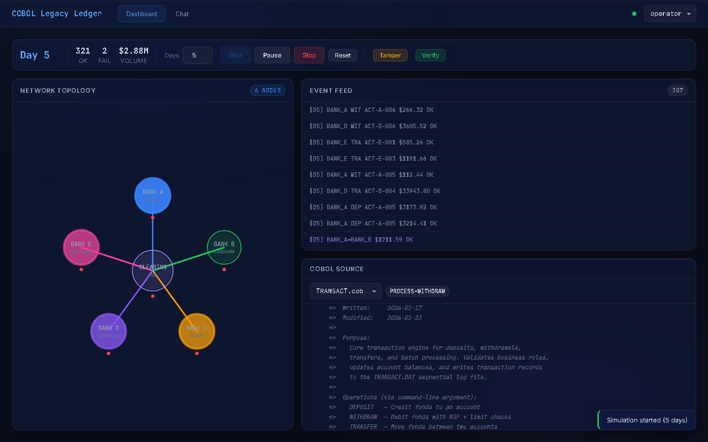
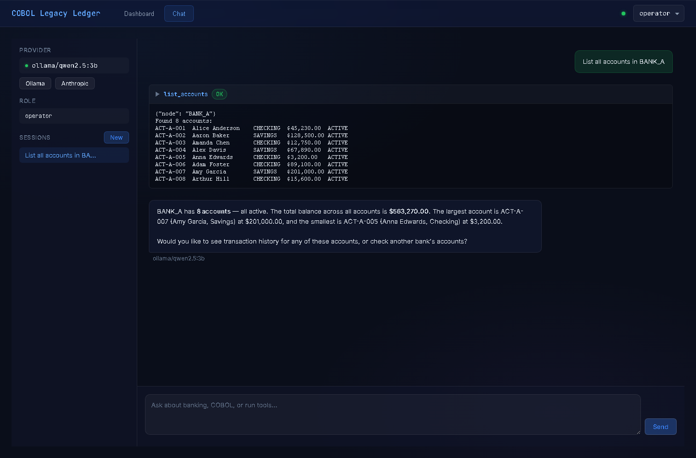

# COBOL Legacy Ledger

[](https://github.com/gitgoodordietrying/cobol-legacy-ledger/actions/workflows/ci.yml)


**A teaching resource for software engineers learning COBOL through a real banking system.**

> "COBOL isn't the problem. Lack of observability is."

This repository is an **IT class teaching resource** — a fully functional inter-bank settlement system written in COBOL, wrapped with a Python observation layer that adds SHA-256 hash chain verification without modifying a single line of COBOL. Every source file is thoroughly commented to teach COBOL syntax, banking concepts, and modern integration patterns.

## How to Use This Repository

### For Students (Self-Study)

Start with the **[Learning Path](docs/LEARNING_PATH.md)** — a guided reading order from beginner to advanced, with exercises at each stage.

### For Instructors

See the **[Teaching Guide](docs/TEACHING_GUIDE.md)** — 8 structured lessons covering COBOL fundamentals through modern integration, with objectives and exercises for each lesson.

### For Reference

The **[Glossary](docs/GLOSSARY.md)** defines every COBOL keyword, banking term, and project-specific concept used in the codebase.

## Quick Start

```bash
# See the full system in action (30 seconds)
./scripts/prove.sh
```

This single command:

1. **Compiles** 10 COBOL programs (3,600+ lines of production-style banking code)
2. **Seeds** 6 independent banking nodes (42 accounts, $100M+ in balances)
3. **Settles** an inter-bank transfer: Alice@BANK_A pays Bob@BANK_B $2,500 through the clearing house
4. **Verifies** all SHA-256 hash chains intact across the network
5. **Tampers** one bank's ledger directly (bypassing COBOL and the integrity chain)
6. **Detects** the tamper in <5ms via balance reconciliation

No Docker required. Just GnuCOBOL + Python 3.9+. Falls back to Python-only mode if COBOL isn't installed.

### API Server + Web Console

```bash
# Start the REST API + web console (auto-docs at http://localhost:8000/docs)
pip install -e ".[dev]"
uvicorn python.api.app:app --reload
# Open http://localhost:8000/ → redirects to the web console
```

The **web console** at `http://localhost:8000/console/` provides:
- **Dashboard** — Hub-and-spoke network graph, simulation controls (start/pause/stop), real-time event feed via SSE, and a COBOL source viewer with syntax highlighting
- **Chat** — LLM chatbot with tool-use cards, provider switching (Ollama/Anthropic), and session management

<p align="center">
  
</p>
<p align="center">
  
</p>

## What You'll Learn

### COBOL Fundamentals (Lessons 1-4)

| Concept | Where to Find It | File |
|---------|-------------------|------|
| Four divisions (IDENTIFICATION, ENVIRONMENT, DATA, PROCEDURE) | Every `.cob` file | Start with `SMOKETEST.cob` |
| PIC clauses (`X`, `9`, `S9`, `V99`) | Copybook annotations | `ACCTREC.cpy`, `TRANSREC.cpy` |
| 88-level condition names | Account status flags | `ACCTREC.cpy`, `COMCODE.cpy` |
| FILE-CONTROL / SELECT ASSIGN | File-to-program binding | `ACCOUNTS.cob` |
| COPY statement (copybooks) | Shared record definitions | Every `.cob` file |
| PERFORM / PERFORM VARYING | Loops and subroutines | `ACCOUNTS.cob`, `TRANSACT.cob` |
| EVALUATE TRUE | Switch/case equivalent | `TRANSACT.cob`, `REPORTS.cob` |
| STRING / UNSTRING | String manipulation | `ACCOUNTS.cob`, `TRANSACT.cob` |

### Banking Operations (Lessons 5-7)

| Concept | Where to Find It | File |
|---------|-------------------|------|
| Account lifecycle (CRUD) | Account master file operations | `ACCOUNTS.cob` |
| Transaction processing | Deposits, withdrawals, transfers | `TRANSACT.cob` |
| Batch processing | Pipe-delimited input files | `TRANSACT.cob` (BATCH mode) |
| Interest accrual | COMPUTE with ROUNDED | `INTEREST.cob` |
| Fee processing | Balance floor protection | `FEES.cob` |
| Reconciliation | Cross-file balance verification | `RECONCILE.cob` |
| Inter-bank settlement | 3-leg clearing house settlement | `SETTLE.cob` |

### Modern Integration (Lesson 8)

| Concept | Where to Find It | File |
|---------|-------------------|------|
| COBOL subprocess wrapping | Mode A: calling COBOL from Python | `python/bridge.py` |
| Fixed-width file I/O | Mode B: Python reads/writes DAT files | `python/bridge.py` |
| SHA-256 hash chains | Cryptographic tamper detection | `python/integrity.py` |
| Cross-node verification | Multi-node settlement matching | `python/cross_verify.py` |
| REST API (FastAPI) | HTTP endpoints wrapping all operations | `python/api/` |
| LLM tool-use | AI chatbot with RBAC-gated banking tools | `python/llm/` |

## Architecture

```
                    ┌─────────────────────┐
                    │  Layer 4: Console   │
                    │  Glass Morphism UI  │
                    │  Dashboard + Chat   │
                    └─────────┬───────────┘
                              │
                    ┌─────────┴───────────┐
                    │   Layer 3: LLM/API  │
                    │  FastAPI + Tool-Use │
                    │  Ollama / Anthropic  │
                    └─────────┬───────────┘
                              │
                    ┌─────────┴───────────┐
                    │  Layer 2: Python     │
                    │  Bridge + Integrity  │
                    │  Settlement + RBAC   │
                    └─────────┬───────────┘
                              │
BANK_A ─────┐                 │                ┌───── BANK_D
BANK_B ─────┤◄── Settlement ──┤──────────────►├───── BANK_E
BANK_C ─────┘    Coordinator  │                └───── CLEARING
                              │
                    ┌─────────┴───────────┐
                    │  Layer 1: COBOL     │
                    │  10 programs, DAT   │
                    │  SHA-256 chain/node  │
                    └─────────────────────┘
```

**6 nodes** (5 banks + 1 clearing house), each with:
- `ACCOUNTS.DAT` — COBOL fixed-width account records (70 bytes each)
- `TRANSACT.DAT` — COBOL transaction log (103 bytes each)
- `{node}.db` — SQLite with integrity chain, transaction history, account snapshots

**Inter-bank settlement** flows through 3 steps:
1. Source bank debits sender's account
2. Clearing house records both sides (deposit from source, withdraw to dest)
3. Destination bank credits receiver's account

Every step is recorded in the node's SHA-256 hash chain. Cross-node verification matches settlement references across all 6 chains.

See [docs/ARCHITECTURE.md](docs/ARCHITECTURE.md) for the full topology, data flow, and integrity model.

## Repository Structure

```
COBOL-BANKING/           Standalone COBOL banking system
  src/                   10 COBOL programs — thoroughly commented for teaching
    SMOKETEST.cob        START HERE — minimal program, teaches all 4 divisions
    ACCOUNTS.cob         Account lifecycle: CREATE, READ, UPDATE, CLOSE, LIST
    TRANSACT.cob         Transaction engine: DEPOSIT, WITHDRAW, TRANSFER, BATCH
    VALIDATE.cob         Business rules: status checks, balance limits
    REPORTS.cob          Reporting: STATEMENT, LEDGER, EOD, AUDIT
    INTEREST.cob         Monthly interest accrual (COMPUTE, ROUNDED)
    FEES.cob             Monthly maintenance fee processing
    RECONCILE.cob        Transaction-to-balance reconciliation
    SIMULATE.cob         Deterministic daily transaction generator
    SETTLE.cob           3-leg inter-bank clearing house settlement
  copybooks/             Shared record definitions — annotated with byte offsets
    ACCTREC.cpy          Account record (70 bytes) — PIC clause tutorial
    TRANSREC.cpy         Transaction record (103 bytes)
    COMCODE.cpy          Status codes, bank IDs, constants
    ACCTIO.cpy           Shared account I/O table (OCCURS clause tutorial)
    SIMREC.cpy           Simulation parameters (REDEFINES tutorial)
  data/                  6 independent node directories (gitignored)

python/                  Python observation layer — commented for integration concepts
  bridge.py              COBOL subprocess execution + DAT file I/O + SQLite sync
  integrity.py           SHA-256 hash chain + HMAC verification
  settlement.py          3-step inter-bank settlement coordinator
  cross_verify.py        Cross-node integrity verification + tamper detection
  simulator.py           Multi-day banking simulation engine
  cli.py                 Command-line interface (seed, transact, verify, simulate)
  auth.py                RBAC (4 roles, 16 permissions)
  api/                   FastAPI REST layer
    app.py               Application factory + static mounts + exception handlers
    routes_banking.py    Account, transaction, chain, settlement endpoints
    routes_simulation.py Simulation control + SSE streaming + tamper demo
    routes_codegen.py    COBOL parse/generate/edit/validate endpoints
    routes_chat.py       LLM chat with tool-use resolution
    routes_health.py     System health check
  llm/                   LLM tool-use layer
    tools.py             12 tool definitions (Anthropic-compatible schema)
    tool_executor.py     RBAC-gated dispatch to bridge/codegen
    providers.py         Ollama (local) + Anthropic (cloud) providers
    conversation.py      Session management + tool-use loop
    audit.py             SQLite audit log for all tool invocations
  tests/                 372 tests (321 unit + 51 E2E) — all green

console/                 Web dashboard + chatbot UI (static HTML/CSS/JS)
  index.html             SPA shell — nav tabs, role selector, health dot
  css/                   Glass morphism design system (5 files)
  js/                    Modular vanilla JS (7 files: app, API client, graph, viewer, dashboard, chat, utils)

docs/
  ARCHITECTURE.md        Full system topology, data flow, integrity model
  GLOSSARY.md            COBOL, banking, and project terminology
  TEACHING_GUIDE.md      Instructor's manual — 8 structured lessons
  LEARNING_PATH.md       Student self-study guide with exercises
  archive/               Original specification and handoff documents

scripts/
  prove.sh               Executable proof — run this first
  build.sh               Compile COBOL programs
  seed.sh                Seed all 6 nodes with demo data
```

## Key Design Decisions

**Dual-mode execution** — Every operation works two ways: Mode A calls compiled COBOL binaries as subprocesses (production path), Mode B uses Python file I/O as fallback (when `cobc` isn't available). Same business logic, same data formats.

**COBOL immutability** — The COBOL programs are never modified. Python wraps them non-invasively, reading their output and maintaining integrity chains alongside the legacy data.

**Per-node isolation** — Each node has its own SQLite database and hash chain. No shared ledger. This mirrors how real banking systems operate — distributed, independent, reconciled through settlement.

**Tamper detection** — Two layers: (1) SHA-256 hash chains detect if chain entries are modified or deleted, (2) balance reconciliation compares DAT file balances against SQLite snapshots to detect direct file tampering.

## Prerequisites

- **Python 3.9+** (required)
- **GnuCOBOL 3.x** (optional — falls back to Python-only mode)

```bash
# Ubuntu/Debian
sudo apt install gnucobol

# macOS
brew install gnucobol

# Windows (MSYS2)
pacman -S mingw-w64-x86_64-gnucobol
```

## Status Codes

COBOL programs return standard status codes in all responses:

| Code | Meaning | COBOL Constant |
|------|---------|----------------|
| `00` | Success | `RC-SUCCESS` |
| `01` | Insufficient funds | `RC-NSF` |
| `02` | Limit exceeded | `RC-LIMIT-EXCEEDED` |
| `03` | Invalid account/operation | `RC-INVALID-ACCT` |
| `04` | Account frozen | `RC-ACCOUNT-FROZEN` |
| `99` | System error | `RC-FILE-ERROR` |

These are defined in `COBOL-BANKING/copybooks/COMCODE.cpy` and shared across all programs.

## Running Tests

```bash
# Unit tests (321 tests)
python -m pytest python/tests/ -v --ignore=python/tests/test_e2e_playwright.py

# E2E tests (51 tests, requires running server + Playwright)
python -m pytest python/tests/test_e2e_playwright.py -v

# All 372 tests
python -m pytest python/tests/ -v
```

## License

MIT
