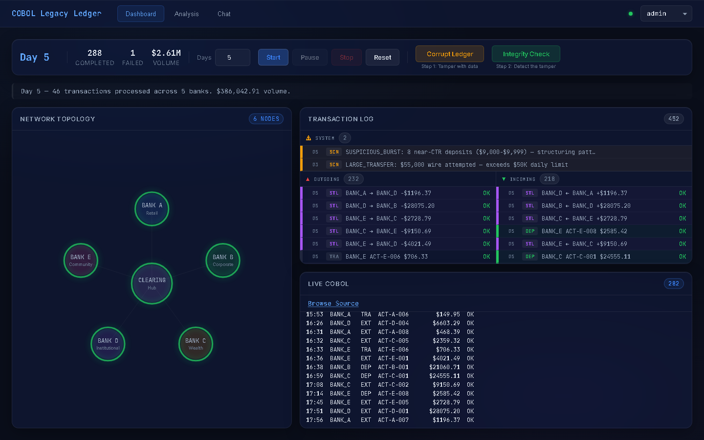
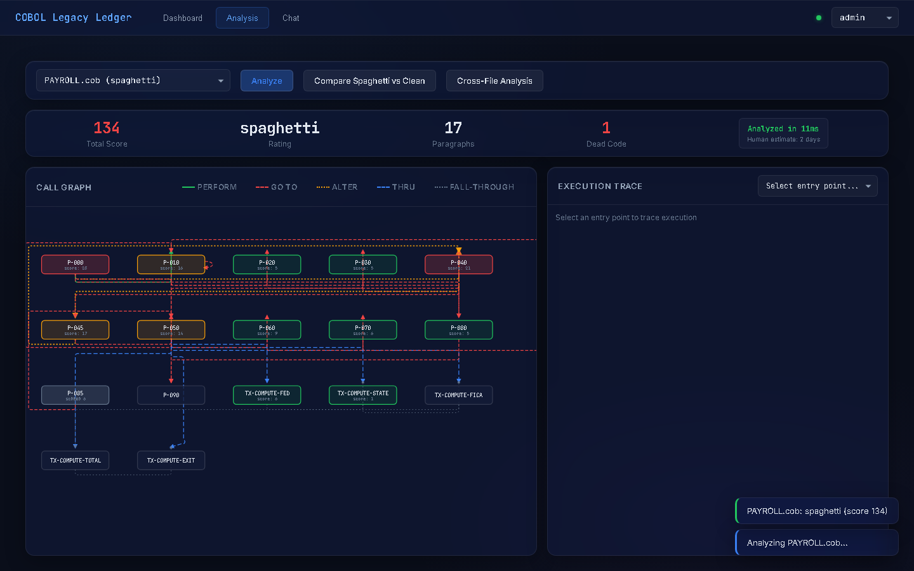
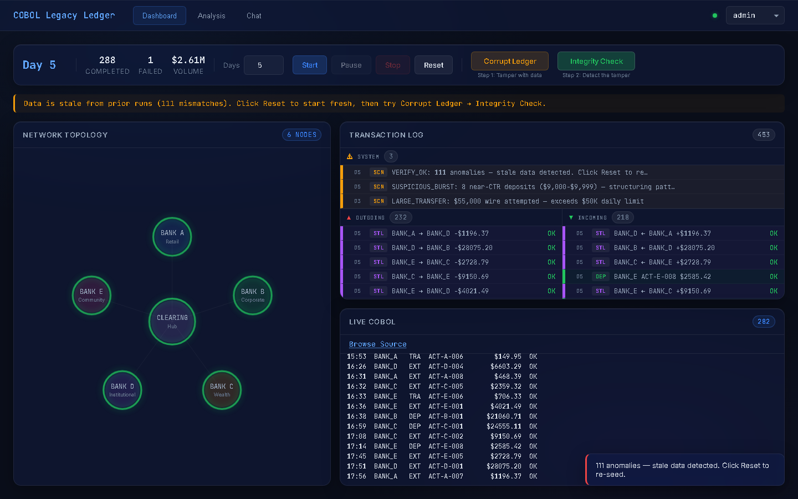

# I Built a COBOL Banking System to Prove Legacy Code Isn't the Problem

Somewhere around $3 trillion moves through COBOL systems every single day. That is not a typo. The language that most developers treat as a punchline processes more money daily than the GDP of most countries. Banks, insurance companies, and government agencies run on COBOL not because they are lazy, but because these systems *work* -- and rewriting them is a bet-the-company risk that rarely pays off.

So why did I build a fully functional 6-node inter-bank settlement system in COBOL from scratch?

Because I got tired of hearing the wrong diagnosis.

## The real problem isn't the language

Every few years, the tech press runs the same story: COBOL is old, COBOL developers are retiring, COBOL is a ticking time bomb. The framing is always the same -- the *language* is the problem. Replace COBOL with something modern and everything will be fine.

That framing is wrong. I have spent enough time reading legacy code to know that the actual problem is simpler and harder to fix: **lack of observability**. These systems work. They process transactions correctly. But nobody can *see* what they are doing. There are no dashboards, no trace logs, no integrity proofs. When something goes wrong, a handful of specialists manually inspect flat files and JCL output. That is the real risk -- not the language, but the blindness.

The thesis behind this project is one sentence: **"COBOL isn't the problem. Lack of observability is."**

To prove it, I built the observability layer myself.

## What I actually built

The system models a simplified inter-bank network: five independent banks (BANK_A through BANK_E) and a central clearing house, each operating autonomously with their own COBOL data files. The architecture has five layers:

**Layer 1 -- COBOL banking core.** Ten structured COBOL programs handle everything a real banking system does: account lifecycle, deposits, withdrawals, inter-bank transfers, interest accrual, fee processing, reconciliation, and settlement. Each program reads and writes fixed-width flat files (70-byte account records, 103-byte transaction records). This is the "legacy system" that never gets modified.

**Layer 2 -- Python observation bridge.** A Python wrapper calls COBOL programs as subprocesses and records every operation in a SHA-256 hash chain stored in SQLite. The key constraint: *no COBOL code is modified*. The bridge reads COBOL's output files, snapshots balances, and builds cryptographic integrity proofs alongside the existing data. If you do not have a COBOL compiler installed, the bridge falls back to Python-only mode using the same record formats -- every test passes either way.

**Layer 3 -- REST API and LLM integration.** FastAPI exposes the entire system as HTTP endpoints. An AI chatbot (Ollama locally or Claude via API) can query accounts, run transactions, verify chains, and analyze COBOL source -- all gated by role-based access control with 18 permissions across 4 roles.

**Layer 4 -- Web console.** A static HTML/CSS/JS dashboard (no Node.js, no build step) with a hub-and-spoke network visualization, real-time simulation via Server-Sent Events, and a COBOL source viewer with syntax highlighting.

**Layer 5 -- Spaghetti analysis.** Eight intentionally terrible COBOL programs spanning four decades of anti-patterns, paired with AI-powered static analysis tools that can trace GO TO chains, detect dead code, score complexity, and map cross-file dependencies.



## The moment that makes it click

The demo that sells the whole concept takes about ten seconds.

You seed the network with 42 accounts across 6 nodes -- over $100 million in balances. You run a simulation that generates realistic daily transactions: deposits, withdrawals, inter-bank transfers flowing through the clearing house. Every operation gets hashed into each node's SHA-256 chain. You hit "Verify All" and every node comes back green. The chain is intact.

Then you corrupt a ledger. One click. The system reaches into BANK_C's flat file and changes an account balance directly -- bypassing COBOL, bypassing the bridge, bypassing the hash chain. This is the scenario that keeps bank auditors up at night: someone with file-level access edits a number.

You hit "Integrity Check" again. In under 100 milliseconds, the system flags the exact account, the exact discrepancy, the exact node. The DAT file says $999,999.99. The last verified snapshot says $150,000.00. Tamper detected.

That is the argument made tangible. The COBOL code did not change. The COBOL code did not need to change. What changed is that now you can *see*.



## Teaching legacy code archaeology

The second half of the project tackles a different angle: what do you do when the COBOL you inherit is not clean?

I wrote eight intentionally spaghetti COBOL programs, each modeled after real anti-patterns from specific eras of mainframe development. A 1974-era payroll controller with GO TO networks and the ALTER statement (which modifies branch targets at runtime -- yes, really). A 1983 tax calculator with six levels of nested IF and no END-IF delimiters. A 2002 batch formatter littered with Y2K-era dead code that nobody dared remove. Each program has a fictional developer backstory and every anti-pattern is cataloged with issue codes.

The static analysis pipeline can parse these programs and produce structured results in milliseconds:

- **Call graph analysis** maps paragraph dependencies, including GO TO chains and ALTER targets
- **Dead code detection** identifies unreachable paragraphs that have been sitting dormant for decades
- **Complexity scoring** weights each paragraph by anti-pattern density (ALTER scores +10, GO TO scores +5, each nesting level +1)
- **Cross-file dependency analysis** traces CALL and COPY relationships across the full codebase

The analysis tab in the web console renders these as interactive visualizations -- directed graphs for call flow, side-by-side comparison of spaghetti versus clean implementations, and execution traces that follow the actual runtime path through a GO TO maze. A timer at the bottom reads something like: "Analyzed in 12ms. Human estimate: 2 days."

The point is not that AI replaces the COBOL specialist. The point is that deterministic tools can handle the mechanical work -- tracing branches, counting nesting levels, mapping dependencies -- so the human can focus on understanding *intent*.



## Try it yourself

The fastest path is Docker:

```bash
git clone https://github.com/albertdobmeyer/cobol-legacy-ledger.git
cd cobol-legacy-ledger
docker compose up
```

Open `http://localhost:8000/console/`, hit Start on the dashboard, and run a simulation. Then try Corrupt Ledger followed by Integrity Check.

Without Docker:

```bash
git clone https://github.com/albertdobmeyer/cobol-legacy-ledger.git
cd cobol-legacy-ledger
pip install -e ".[dev]"
python -m python.cli seed-all
python -m uvicorn python.api.app:create_app --factory --host 127.0.0.1 --port 8000
```

GnuCOBOL is optional. The system falls back to Python-only mode automatically, and all 807 tests pass either way. If you want the full end-to-end proof -- compile, seed, settle, verify, tamper, detect -- run `./scripts/prove.sh` or `make prove`.

There is also a [live demo](https://cobol-legacy-ledger-production.up.railway.app/console/) running on Railway if you just want to poke around.

## What I learned

**Wrapping beats rewriting.** The entire integrity layer -- hash chains, balance reconciliation, cross-node verification -- was built without modifying a single line of COBOL. That is not a limitation; it is the design. Legacy systems have survived for decades precisely because they are stable. Adding observability around them is safer, faster, and cheaper than rewriting them.

**Fixed-width records are underrated.** COBOL's 70-byte account records are not elegant by modern standards, but they are completely deterministic. No encoding ambiguity, no schema migration, no serialization overhead. Every byte is accounted for. There is something appealing about a data format where you can calculate the file offset of any record with multiplication.

**Anti-patterns are best taught by example.** Reading about GO TO networks in a textbook is one thing. Tracing execution through a paragraph called `P-042-GOTO-ADJUST` that ALTER-branches to `P-099-FINAL-EXIT` which falls through to dead code from 1987 -- that is a different kind of understanding. The eight spaghetti programs taught me more about legacy code sympathy than any style guide ever could.

**Observability is a universal lever.** This project is about COBOL, but the principle applies everywhere. The most dangerous systems are not the ones running old code. They are the ones running code that nobody can inspect, trace, or verify. Add visibility and the risk profile changes overnight.

## The takeaway

COBOL is not going anywhere. The $3 trillion-a-day infrastructure that runs on it is too critical, too tested, and too expensive to replace. The question is not "how do we get rid of COBOL?" It is "how do we make COBOL systems observable, verifiable, and safe to operate for the next generation of engineers who did not write them?"

This project is one answer to that question. Wrap, do not rewrite. Observe, do not modify. Prove integrity with math, not trust.

The code is [on GitHub](https://github.com/albertdobmeyer/cobol-legacy-ledger). MIT licensed. Contributions welcome.
